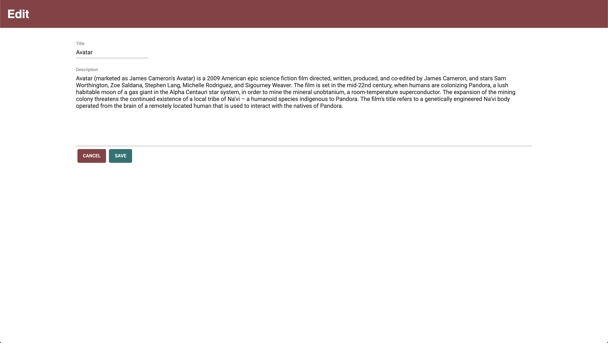

# Movie List

Movie List is a web application that displays a list of movies and allows the user to click into each movie, see the details for that movie, and edit the title and/or description.

## Built With

React.js, Redux, JavaScript, Node.js, Express.js, SQL, Postgres, HTML and CSS.

## Getting Started

### Prerequisites

- Node.js
- React.js
- Express.js
- Postgres

### Installing

1. Download or clone repo.
2. `npm install`
3. `npm start server` in one terminal window
4. `npm run client` in another terminal window

## Screen Shots

### Completed Features

- GET/PUT routes created
- Specific GET route for a movie's details
- Page navigation with buttons
- Ability to edit title and/or description of movies

### Next Steps

- Display movie genres on the homepage
- Adjust details routes to allow page refresh
- Set up POST/DELETE for movies